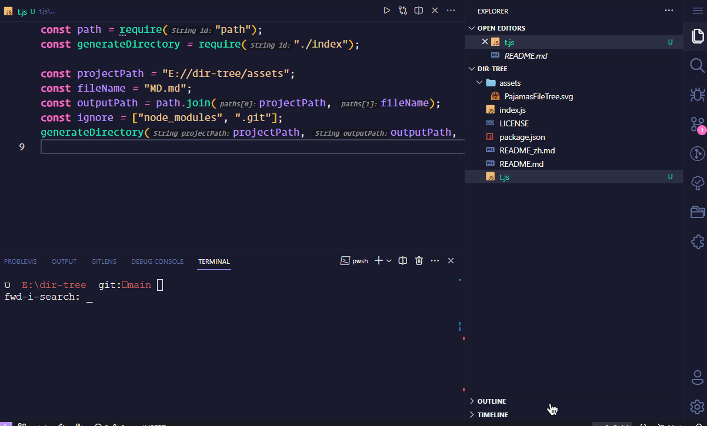

<p align="center">

</p>
<p align="center"> <a href="./README.md">English</a> | 简体中文</p>

用于生成项目目录树，支持 markdown 和 txt 两种文件格式。

<br>

## Usage

### 首先你需要安装它: `npm i -D file-mkdir`

#### 你可以直接调用接口生成树文件，默认导出 md 类型文件：

```js
# generateDirectory has default parameters

# generateDirectory(
#   projectPath = __dirname,
#   outputPath = path.join(projectPath, "MD.md"),
#   ignore = ["node_modules", ".git", "dist", ".vscode", ".github"]
# )

# So u can just call it

const generateDirectory = require("file-mkdir");

generateDirectory();

```

#### 同样的你可以自己来配置参数，定义生成的文件格式：

<br>

```js
const path = require("path");
const generateDirectory = require("file-mkdir");

# 希望从那个位置开始遍历文件
const projectPath = "E://picture";

# markdown
const fileName = "MD.md";
# OR txt
const fileName = "MD.txt";

# 生成的文件位置
const outputPath = path.join(projectPath, fileName);
const ignore = ["node_modules", ".git"];

generateDirectory(projectPath, outputPath, ignore);

```

<br>

## Feature



## License

[MIT](./license)
